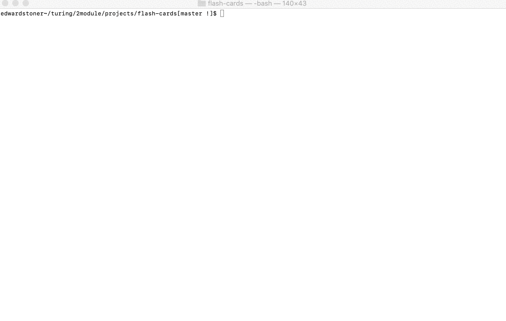

# FlashCards

## Abstract

This is a flash-card program that is playable from the command line. It quizzes the user on two different data sets about fundamental JavaScript concepts. If the user gets fewer than 90% of the questions correct, the round repeats. Once the user gets more than 90% of the questions correct, he or she has an additional opportunity to review any wrong questions.

## GIF of the working application



## Install/setup instructions

From the project directory, run ```node index.js``` from the command line.
